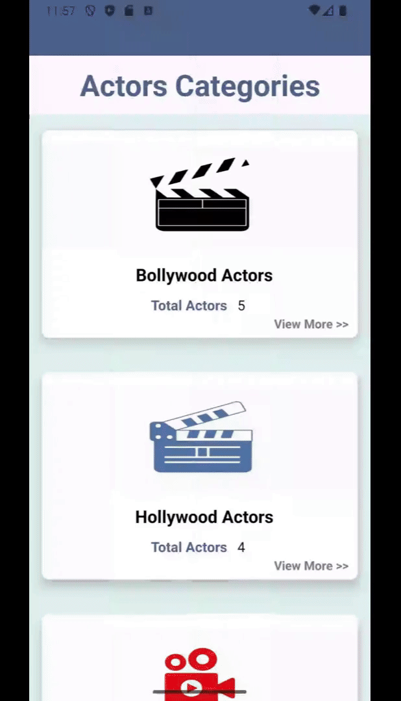

## 📱 Multi-Activity Android App Demo

This app demonstrates a multi-activity flow:

1. **Main screen** displays a list of actors.
2. **Second activity** shows a brief detail when an actor is selected.
3. **Third activity** presents extended information about the selected actor.
4. **Fifth activity** opens a web page related to the actor for more info.

Each transition is handled smoothly with intent-based navigation, showcasing structured content flow across multiple activities.

